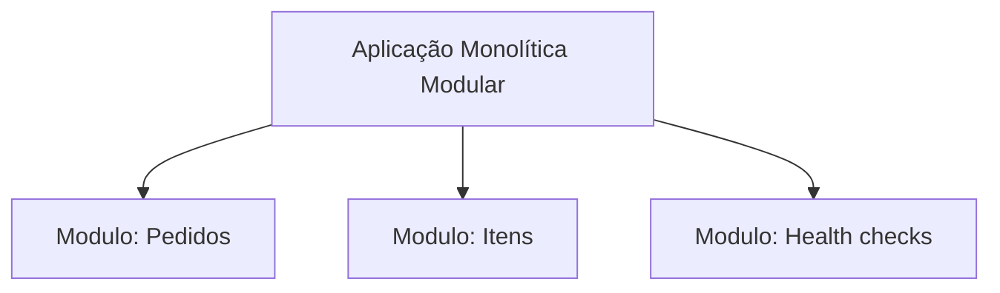

# ADR 0003: Granularidade da Aplicação (Monolito Modular vs. Microsserviços)

- **Status:** Aprovado
- **Data:** 2026-08-14

## Contexto
Um e-commerce considerando os domínios de negócio de Gestão de Pedidos e Itens de Pedido. Avaliar a melhor estratégia de granularidade para o estágio atual do projeto.

O objetivo estratégico é equilibrar três pilares centrais:
- Velocidade de Entrega (Time-to-Market): Capacidade de disponibilizar valor ao negócio com agilidade.
- Previsibilidade Operacional e de Custo (FinOps): Uso racional de recursos computacionais e de rede na Magalu Cloud.
- Simplicidade de Manutenção: Redução da complexidade de observabilidade, depuração e rastreabilidade de erros.

Atualmente, o projeto utiliza o framework FastAPI para implementar todas as rotas (pedidos, itens, health checks e métricas do Prometheus).

Empacotar em imagem Docker (armazenada no Magalu Container Registry - MCR) e orquestrado por Kubernetes.

## Decisão
Decidimos adotar a arquitetura da solução no modelo de **Monolito Modular**.

- Reduz complexidade de deploy e observabilidade em estágios iniciais do projeto.
- Permite organizar o código em módulos independentes (ex.: pedidos, itens, health checks), mantendo separação lógica.
- Permite migração gradual para microserviços, caso o crescimento da aplicação justifique.

## Consequências

- **Positivas:**
    - Simplicidade Operacional e de Deploy: Requer a manutenção de apenas uma esteira de CI/CD (GitHub Actions) e o monitoramento de um único recurso de *Deployment* no Kubernetes, reduzindo a carga de trabalho e o risco operacional.
    - Eficiência Financeira (FinOps): Otimiza o custo fixo de infraestrutura, evita criar recursos sem necessidade neste momento do projeto.
    - Baixa Latência Interna: A comunicação entre os módulos de domínio ocorre em memória (chamadas de função), eliminando a latência de rede e os riscos de falhas de conectividade.

- **Negativas:**
    - Escalabilidade Acoplada: Se apenas a rota de consulta de pedidos estiver sob carga elevada, toda a aplicação será replicada.
    - Falhas: Um erro crítico ou vazamento de memória em qualquer módulo pode indisponibilizar toda a aplicação, já que todos compartilham o mesmo processo e os mesmos recursos do Pod.
    - Complexidade de Evolução: Se o domínio crescer significativamente e múltiplos times passarem a atuar no código, a ausência de fronteiras físicas de rede pode dificultar o isolamento de responsabilidades caso a modularização do código não seja rigorosamente mantida.