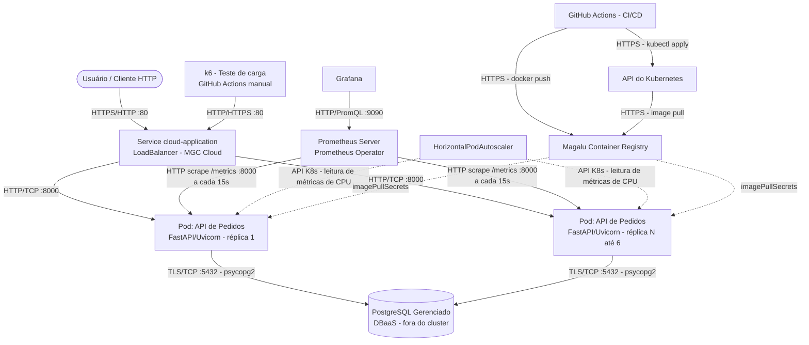

**Aluno:** José Luiz Fagundes
**Repositório do Projeto:** https://github.com/jlfagundes-dev/move-tech-decisoes-arquitetura-cloud

# Documentação de Arquitetura da Solução

## 1. Mapeamento de Recursos (Cluster & Cloud)
- **Cluster Kubernetes (Magalu Cloud):**
	- App API (Container em FastAPI)
	- Service `LoadBalancer` (expõe porta pública)
	- HorizontalPodAutoscaler (HPA)
	- ServiceMonitor (Prometheus)
- **Serviços Externos / Managed Services:**
	- PostgreSQL Gerenciado (DBaaS)
	- Magalu Cloud Container Registry (MCR)
	- Prometheus + Grafana (observability stack)

## 2. Diagrama C2 (Nível de Containers)

Estilo Arquitetural e RNFs
- **Estilo:** Monolito Modular em Camadas com Implantação Cloud-Native em Contêineres.
- **Disponibilidade Alvo:** 99.9% (SLA)
- **Latência P95:** < 200ms sob carga normal.
- **RPS Alvo:** 500 requisições por segundo.
- **Teto de Custo (FinOps):** R$ 150,00/mês (alocação otimizada de recursos).
---
